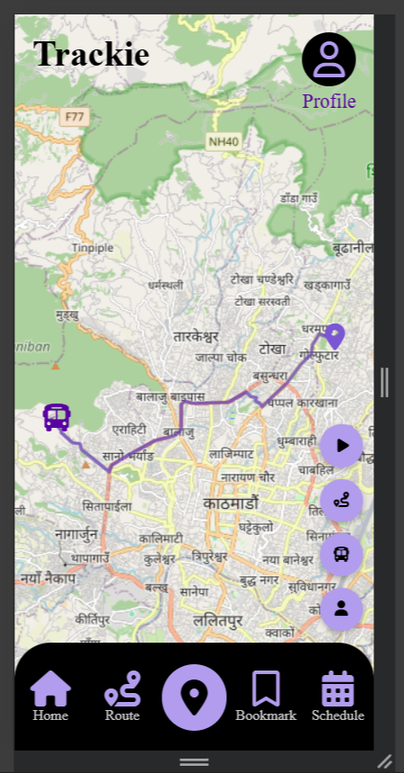

# Trackie (Bus Tracking System)

  

Trackie is a simple bus tracking system built using php, leaflet js, js. It allows users to track buses in real-time, plan their arrival at bus stops efficiently, and helps drivers share their live location with passengers. This project is primarily for learning purposes and is not production-ready.

## Table of Contents
- [About](#about)
- [Features](#features)
- [Built With](#built-with)
- [Getting Started](#getting-started)
  - [Prerequisites](#prerequisites)
  - [Installation](#installation)
- [Usage](#usage)
- [Project Structure](#getting-started)
- [Contributing](#contributing)
- [Logo License](#logo-license)
- [Acknowledgement](#acknowledgement)
- [License](#license)
- [Contact](#contact)

## About
Trackie is a bus tracking system designed for mobile friendly interfaces. Users can:
- Create account, login, logout.
- See user profile.
- Track bus location according to route or bus models.
- Driver can share location to database to show it to users.
- Has a simulator to see bus tracking system.  
 

   &nbsp;&nbsp;&nbsp;&nbsp;
  

   &nbsp;&nbsp;&nbsp;&nbsp;
  

  

## Features
- Real-time Maps: Powered by Leaflet.js.
- Asynchronous Data: Uses jQuery AJAX to communicate with PHP backend.
- Secure Database Handling: MySQL connections using Prepared Statements.
- Input Validation: Basic handling to ensure data integrity.
- Simulator Mode: Allows users to test the system without real buses.

## Built With
**Frontend:** HTML, CSS, Vanilla JavaScript, Leaflet JavaScript  
**Backend:** PHP  
**Database:** MySQL  
**Tools:** Figma(UI design, logo design), XAMPP(local server), VsCode(IDE), LucidChart(ER-diagram)

## Getting Started
### Prerequisites
- PHP 7.x or later
- MySQL 5.x or later
- XAMPP or any local server environment

### Installation
- Clone the repository:  git clone https://github.com/BinatoDrkLight/ProjectIBCA4thSem.git
- Move the project folder to your htdocs folder.
- Import the trackie.sql database file into MySQL.
- Start the XAMPP server and navigate to http://localhost/Trackie.

## Usage
- Users can register, log in, and track buses by route or model.
- Drivers should open the driver interface to send their location to the database.
- Use the simulator to test real-time tracking without an active driver.

## Project Structure
- Admin
- All
- Assets
- Driver
- Passenger
- SuperAdmin
- .gitignore
- index.php
- LICENSE
- README.md
- trackie.sql

## Contributing
- Report bugs or suggest features via GitHub Issues.
- Fork the repository and submit pull requests.

## Logo License
The project logo  is © 2025 BinatoDrkLight and licensed under CC BY 4.0. Please provide credit if used or modified.

## Acknowledgements
- Font Awesome (Icons)
- Leaflet.js (Maps)
- Figma (UI design)
- ChatGPT (Assisted with track page and multi level menu)

## License
© BinatoDrkLight 2025. This project is licensed under the **MIT License**  
You are free to use, modify, and distribute this software, provided that you include the original copyright and license notice in any copies or substantial portions of the software.  
See the [LICENSE](LICENSE) file for details.

## Contact
Author: Binesh Adhikari  
Email: binesh2adhikari@gmail.com  
GitHub: https://github.com/BinatoDrkLight/  
LinkedIn: https://www.linkedin.com/in/binesh-adhikari-it  